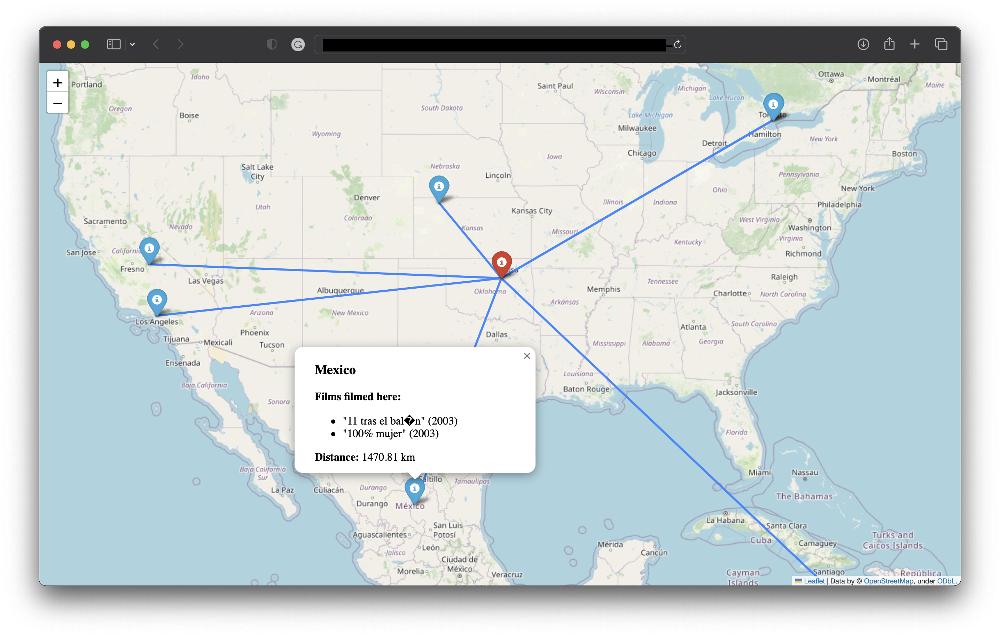

# Films Map

## About project

This project shows a map with 10 closest films filmed near a specific location in some year. The result will be saved in a map in HTML format that can be opened in a web browser.

This information can be used for tourists and people interested in filming and who want to visit legendary places nearby.

## Result example

Example for the following command

```cmd
python3 main.py 2003 36 -96.5 locations1000.list
```



## Time restriction

The original file has 1.200.000 films and serials. It's too much for a normal situation. So we were forced to decrease _locations.list_ to 40.000. If you feel it's too long or you have a bad internet connection, there is _location1000.list_, which has 1000 films, or feel free to decrease files more.

## Installation and start

To start the project do the following commands:

### Install requirements

```cmd
python3 -m venv venv

source venv/bin/activate # if you are using macOS
venv/bin/activate # for Windows

pip3 install requirements.txt
```

### Start project

```cmd
python3 main.py {year} {latitude} {longitude} {path_to_file}
```

- _year_ - the year in which films were created. Example: 2000
- _latitude_ - latitude of the starting point. Example: 49.841952
- _longitude_ - longitude of starting point. Example: 24.0315921
- _path_to_file_ - path to the database file. Example: location.list

### Determinate

```cmd
deactivate
```

## Contributing

Pull requests are welcome. For major changes, please open an issue first
to discuss what you would like to change.

Please make sure to update tests as appropriate.

## License

[MIT](https://choosealicense.com/licenses/mit/)
